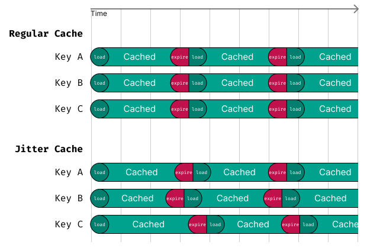

# TTL Jitter

When caching resources at the same time, they will also expire at the same time. This can lead to cache stampedes and thundering herds, where many requests hit the backend simultaneously to refresh the cache.

To solve this issue, you can add the `JitterCache` layer, which adds a random jitter to the TTL of cached items. This spreads out the expiration times, reducing the likelihood of simultaneous cache misses.

```ts
import { JitterCache } from 'cachimbo';

const jitterCache = new JitterCache({
  cache: anotherCache,
  defaultTTL: 120, // Default expiration when no TTL is defined
  maxJitterTTL: 30, // Maximum jitter time to add to the TTL
});

jitterCache.set("mykey", myData, { ttl: 200 });
// the actual ttl would be a random number from 200 to 230 seconds
```

<center>
    
</center>

Notice how in the diagram above, the expiration times are spread out due to the added jitter, preventing a thundering herd effect.
