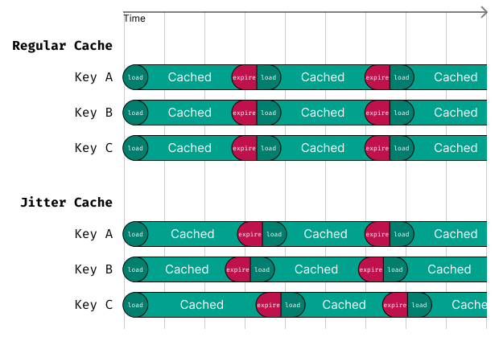

# TTL Jitter

Resources cached at the same time also expire at the same time. This can lead to cache stampedes and thundering herds, where many requests hit the backend simultaneously to refresh the cache.

To solve this issue, you can add the `JitteringCache` layer, which adds a random jitter to the TTL of cached items. This spreads out the expiration times, reducing the likelihood of simultaneous cache misses.

```ts
import { JitteringCache } from 'cachimbo';

const jitterCache = new JitteringCache({
  cache: anotherCache,
  defaultTTL: 120, // Default expiration when no TTL is defined
  maxJitterTTL: 30, // Maximum jitter time to add to the TTL
});

jitterCache.set("mykey", myData, { ttl: 200 });
// the actual ttl will be a random number from 200 to 230 seconds
```

The jitter is only ever added, never subtracted, so an entry never expires earlier than the TTL you asked for.

<p align="center">
    
</p>

Notice how in the diagram above, the expiration times are spread out due to the added jitter, preventing a thundering herd effect.

## Remarks

- Every write goes through this layer with a TTL: entries written without one fall back to `defaultTTL`.
- This layer has no effect on stores that ignore per-item TTLs, such as [NATS](../stores/nats.md), where the expiration is defined at the bucket level.
