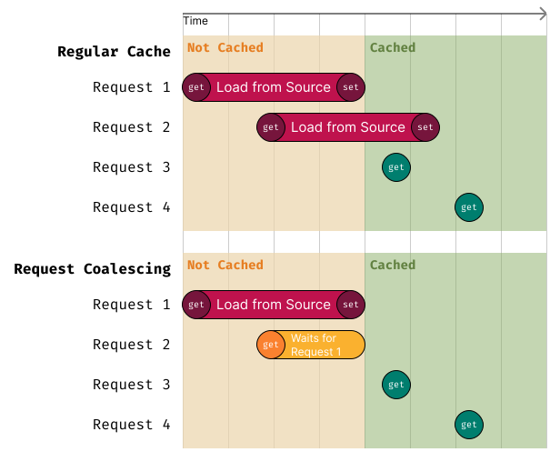

# Request coalescing (deduplication)

When two parallel requests ask for the same cache key, they would normally both hit the external cache server.

The deduplication strategy prevents this by tracking in-flight requests: if a fetch for a given key is already in progress, additional requests for that key wait for the existing one instead of triggering another call to the external server.

```ts
import { CoalescingCache } from 'cachimbo';

const dedupedCache = new CoalescingCache({
  cache: anotherCache,
});
```

<center>
    
</center>

In the above example, the first request for a key triggers a load from the underlying cache. If a second request for the same key arrives while the first is still in progress, it waits for the first request to complete and then receives the same result, avoiding a duplicate load operation.
