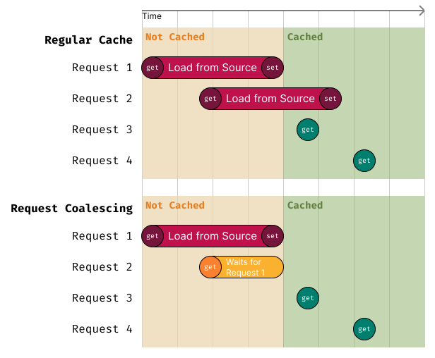

# Request coalescing (deduplication)

When two parallel requests ask for the same cache key, they both hit the external cache server.

The deduplication strategy prevents this by tracking in-flight requests: if a fetch for a given key is already in progress, additional requests for that key wait for the existing one instead of triggering another call to the external server.

The same applies to `getOrLoad`: when the cache misses, only the first request loads from origin and the others receive the result of that same load.

```ts
import { CoalescingCache } from 'cachimbo';

const dedupedCache = new CoalescingCache({
  cache: anotherCache,
});
```

<p align="center">
    
</p>

In the above example, the first request for a key triggers a load from the underlying cache. If a second request for the same key arrives while the first is still in progress, it waits for the first request to complete and then receives the same result, avoiding a duplicate load operation.

## Remarks

- The deduplication happens in-process and per instance, so parallel requests hitting different instances of your application are not coalesced. To reduce the load on your data source across instances, put a shared cache store below this layer.
- This layer is only useful under high traffic scenarios that require the lowest latency possible.
