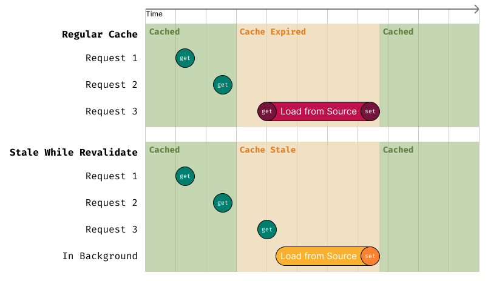

# Stale While Revalidate

When a cache entry expires and the system needs to fetch fresh data, the request can take a long time to complete.

The “Stale While Revalidate” strategy avoids this delay by immediately returning the previously cached value while asynchronously refreshing the data in the background.

This keeps read latency consistently low, even during cache refreshes.

This strategy is similar to the [stale-while-revalidate in browser caching](https://web.dev/articles/stale-while-revalidate).

```ts
import { SWRCache } from 'cachimbo';

const swrCache = new SWRCache({
  cache: anotherCache,
  defaultTTL: 60, // Default TTL that the resource will remain fresh
  staleTTL: 10, // Additional TTL that the resource will keep cached but stale
});

const data = await swrCache.getOrLoad("key", () => loadData());
// From 0 to 60 seconds, the resource will return from the underlying cache
// From 60 to 70 seconds, the resource will return from the underlying cache and a load request will start in background
// After 70 seconds, the item will be completely removed from cache, and any new requests will have to load the resource in foreground
```

<center>
    
</center>

In the example above, the resource is cached. After a few seconds, the cache becomes stale but is still served from the cache while a background refresh is triggered. Once the background refresh completes, the cache is updated with fresh data.

All requests coming in during the stale period receive the stale data immediately, ensuring low latency. The data is still being refreshed in the background, so subsequent requests after the refresh will receive the updated data.

### Remarks

- This cache layer only affects the `getOrLoad` method. Other methods like `get`, `set`, `delete`, etc., behave as they would in the underlying cache.
- This cache layer wraps the data into an object that contains metadata about its freshness.
  - This is done mostly transparently, so you don't have to worry about it when using the cache but keep in mind that it essentially changes the structure of the data in cache.
  - If you are using an external cache store, make sure to version your cache keys using a [Key Transformation](./key-transformation.md) layer to avoid collisions with other data.

```ts
import { SWRCache, KeyTransformingCache, RedisCache } from 'cachimbo';

let myCache: ICache = new RedisCache(...);

if (process.env.ENABLE_SWR === 'true') {
  // Add both the SWR layer with an Key Transformation layer to version the keys
  // If you disable the env flag, the keys will change and this will avoid collisions with old data
  myCache = new KeyTransformingCache({
    cache: new SWRCache({
      cache: myCache,
      defaultTTL: 60,
      staleTTL: 10,
    }),
    suffix: ':swr',
  });
}

const data = await myCache.getOrLoad("data", () => loadData());
```
