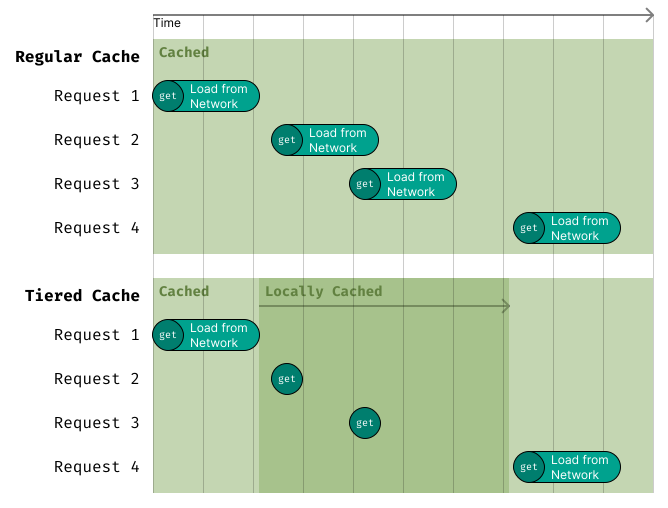

# Tiered Cache (multi-layer caching)

When fetching data from an external cache introduces a few milliseconds of latency, introducing a small in-memory cache can significantly cut down on repeated round-trips.

The Tiered Cache strategy organizes caches into multiple levels, checking each tier in order until the requested data is found. Once a hit occurs, the strategy backfills the earlier tiers to keep them warm and improving performance for future lookups.

A common recommendation is to use two tiers: a small in-memory cache as the first level and your external cache as the second. The in-memory cache should have a short time-to-live to minimize the risk of serving stale data when the external cache is updated.

The concept behind the tiered cache is also known as multi-level caching, L1/L2/L3 caching, CPU caching, hierarchical caching or hybrid caching.

```ts
import { TieredCache } from 'cachimbo';

const tieredCache = new TieredCache({
  tiers: [
    {
      cache: new LocalTTLCache({
        max: 50, // 50 items stored at most to limit memory usage
      }),
      options: {
        ttl: 30,
      },
    },
    {
      cache: new RedisCache(...),
    },
  ],
});

const data = await tieredCache.getOrLoad("key", () => loadData(), { ttl: 60 * 3 });
// The tiered cache will first check the LocalTTLCache for the "key"
// If it's not found, it will then check the RedisCache for the "key"
// If it's also not found, it will finally run loadData()
// After loading the data, it will backfill all caches with the loaded data

// Saving the data into the RedisCache with a TTL of 5 minutes,
// and also saving it to the LocalTTLCache with a TTL of 30 seconds

// Once the resource expires from the LocalTTLCache, requesting again will load it from the RedisCache
// and then backfill the LocalTTLCache with more 30 seconds
```

<p align="center">
    
</p>

In the example above, the tiered cache first checks the in-memory cache for the requested key. If the key is not found there, it checks the external cache, backfilling the in-memory cache to reduce latency on future reads.
