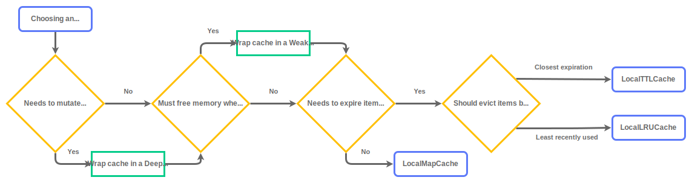

# In-memory Cache

In-memory caches offer extremely low latency since data is stored directly in the application’s process. They reduce external round-trips, improve performance under load, and are ideal for fast, frequently accessed data.

### Choosing the right in-memory cache store

<p align="center">
    
</p>

## In-memory Cache Stores

| Cache Store                                             | TTL expiration   | Size-based eviction                                 | Use Case                                                                                                                      |
|---------------------------------------------------------|------------------|-----------------------------------------------------|-------------------------------------------------------------------------------------------------------------------------------|
| [Least Recently Used (LRU)](#least-recently-used-lru)   | Yes              | Yes, removes the least recently used item first     | When cached items have different access patterns and you want to keep the most frequently accessed items cached.              |
| [Time To Live (TTL)](#time-to-live-ttl)                 | Yes              | Yes, removes the closest to expiration item first   | When cached items naturally expire after a fixed duration and access patterns are not a concern.                              |
| [Map](#map)                                             | No               | Yes, removes the first inserted item first          | When you want a simple, lightweight cache without expiration policies or access-pattern awareness. Most useful for testing.   |

### Least Recently Used (LRU)

Use an LRU cache when memory is limited and you want to keep the most recently used items available, automatically evicting older, less-used entries.

It is built on top of the [lru-cache](https://www.npmjs.com/package/lru-cache).

```ts
import { LocalLRUCache } from 'cachimbo';

const cache = new LocalLRUCache({
  max: 100, // maximum number of items in cache (optional)
  ttl: 60, // default expiration (optional)
});

await cache.set("key", "value", { ttl: 30 }); // 30 seconds

const value = await cache.get("key"); // "value"
```

### Time To Live (TTL)

If you don’t need an access-pattern awareness, a TTL cache is faster, simpler, and often sufficient when data naturally expires after a fixed duration.

It is built on top of the [@isaacs/ttlcache](https://www.npmjs.com/package/@isaacs/ttlcache).

```ts
import { LocalTTLCache } from 'cachimbo';

const cache = new LocalTTLCache({
  max: 100, // maximum number of items in cache (optional)
  ttl: 60, // default expiration (optional)
});

await cache.set("key", "value", { ttl: 30 }); // 30 seconds

const value = await cache.get("key"); // "value"
```

### Map

If you don't need an access-pattern awareness nor a time-based expiration policy, you can use a simple Map-based cache. This is useful for testing or scenarios where you want to keep things extremely simple.

This implementation uses a FIFO eviction policy when the maximum size is reached, which means that the first inserted keys will be removed first.

```ts
import { LocalMapCache } from 'cachimbo';

const cache = new LocalMapCache({
  max: 100, // maximum number of items in cache (optional)
});

await cache.set("key", "value");

const value = await cache.get("key"); // "value"
```

Any object that implements `Map` can be used as the underlying store.

```ts
const cache = new LocalMapCache({
  map: new Map<string, any>(), // your custom Map implementation
  // ...
});
```

## In-memory Cache Layers

| Cache Layer              | Use Case                                                                                               |
|--------------------------|--------------------------------------------------------------------------------------------------------|
| [Weak](#weak-references) | When you want the JavaScript engine to automatically delete cached items when it needs to free memory. |

### Weak References

Weak References allow the JavaScript engine to automatically reclaim memory when there are no strong references to an object. This is particularly useful for caching scenarios where you want to allow the garbage collector to free up memory when needed.

The `WeakCache` is a cache layer that wraps values in `WeakRef` and monitors them through a `FinalizationRegistry`. Which means that the cached items can be garbage collected when there are no other strong references to them.

```ts
import { WeakCache, LocalTTLCache } from 'cachimbo';

const cache = new WeakCache({
  cache: new LocalTTLCache(), // underlying cache store, has to be a local one
});

await cache.set("key", { myCoolValue: 1234 });

// Memory fills up, garbage collector runs

const valueAfter = await cache.get("key"); // could be { myCoolValue: 1234 } or null
```

You can combine the WeakCache with any local cache store (like `LocalMapCache`, `LocalTTLCache` or `LocalLRUCache`) to benefit from both caching strategies.

Be warned: The items can be deleted in an unpredictable time and order, as it all depends on the JavaScript engine's memory management and garbage collection process.
